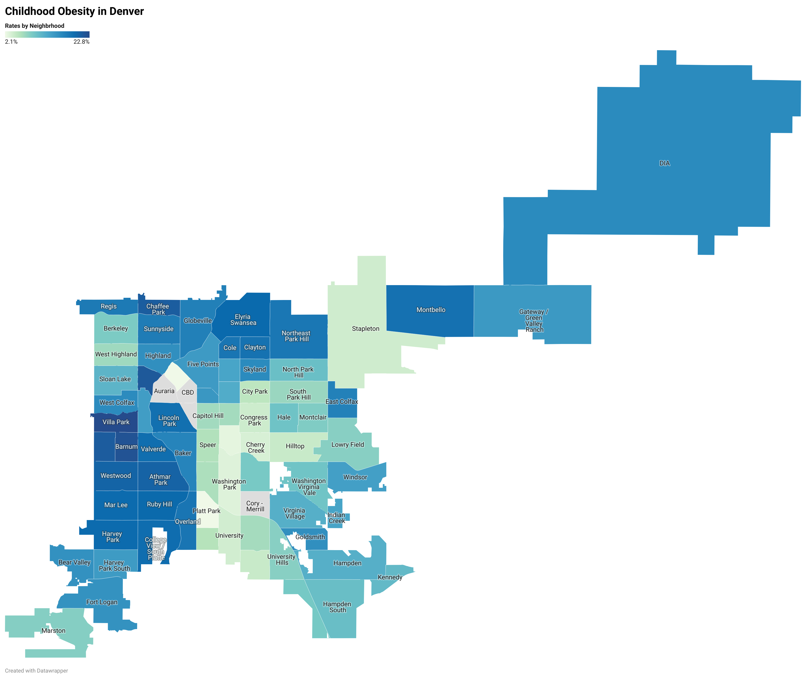

# README File: Denver's Obesity Data

This data repository was created for ENGL105.015, taught in the Spring of 2024 by Dr. Gotzler. 

*In this README file, you will find:* 
1. Repository Contents
2. How to use the repository
3. Example Visualization
4. Acknowldegments

## 1. Repository Contents

In this repository, you will find 5 files:
1. Two `.csv` files with obesity data from Denver, 2014-2016 (Data Folder)
2. A python notebook (`.ipynb` file) with instructions on how to create subsets from this data
3. An example subset in `.csv` file format (Data Folder)
4. Two `.png` files of example visualizations from the dataset (Visualizations Folder)
5. A `.geojson` file useful for data visualization (Visualizations Folder)

## 2. How to use this repository

*Data in this repository can be used to communicate the varying obesity rates of Denvers different neighborhoods*

The data in this repository is very useful and can be manipulated in many ways.

- If you have no experience with manipulation of data using Python, you should start with the python notbeook.
- If you would like to see that original data, access the OriginalData folder
- If you would like to see examples of how to use this data, access the Visualizations folder or the DataSubset `.csv` file
- If you are interested in visualizing this data with a map of Denver, consider using the `.geojson` file (See example visualization)

## 3. Example Visualization:

This visualization depicts obesity rates in different Denver neighborhoods, and is a prime exmaple of how this data can be used. This map clearly shows a trend in the data where Boradway is divider: neighborhoods to the west of Broadway are more obese than those to the east. Many similar powerful visualizations can be made using this data. If a map is the intended visualization, it is best that the `.geojson` file is uploaded to Datawrapper (referenced below).

## 4. Acknowledgements: 

This repository was created for Dr. Gotzler's ENGL105 class, and would not be possible without his teaching.

Original data comes from the [City of Denver Open Data Catalog.](https://denvergov.org/opendata) There are many more useful datasets that can be accessed and manipulated there. The data is liscensed under [CC BY 3.0](https://creativecommons.org/licenses/by/3.0/)

The `.geojson` file is from another GitHub repository, linked [here.](https://github.com/blackmad/neighborhoods/blob/master/denver.geojson) This is an excellent resource for daata visualizaiton at the city scale. 

Data visualizations were created with [Datawrapper,](https://app.datawrapper.de/) an excellent free tool for data visualization. 

